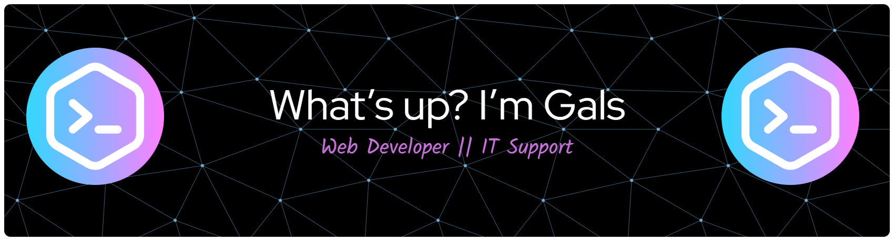

## What’s up? I’m Gals — just a friendly face saying hello to the world!👋

Here are some ideas to get you started:
- 🔭 I’m currently working on simple but fun web projects using **Laravel**, **Phalcon**, and **Docker** — still learning as I go!
- 🌱 I’m currently exploring more about backend development and how APIs really work.
- 👯 I’d love to collaborate or share ideas with fellow learners in web development.
- 🤔 I’m looking for guidance and inspiration to improve my coding workflow.
- 💬 Ask me about my learning journey, or let’s just talk about code (and coffee ☕).
- 📫 How to reach me: You can find me here on GitHub — always happy to connect!
😄 Pronouns: She/Her
⚡ Fun fact: 🎧 When the code stops, the music starts.

